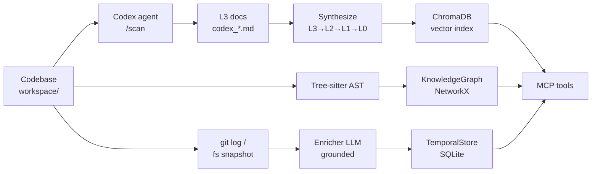
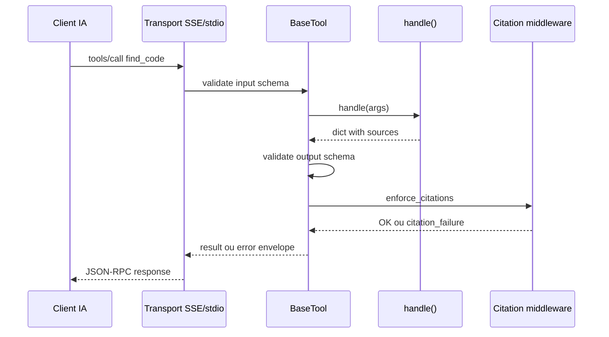

# Heliograph — Pitch honnête pour devs

> Présentation interne. Pas de marketing. Ce qui marche, ce qui ne marche pas, ce qu'on peut faire avec.

---

## 1. En une phrase

Heliograph est un serveur MCP qui indexe une codebase (vector + graph + temporal) et expose ce savoir à des agents IA (Roo, Cursor, Claude Code, Continue) via des outils typés avec citations source-ligne obligatoires.

---

## 2. Ce que ça apporte concrètement

### Bénéfices réels

- **Contexte structuré pour LLM** : au lieu d'embarquer 200k tokens de code dans le prompt, l'agent appelle `find_code` / `ask_expert` / `get_callers` et reçoit du contexte ciblé avec citations vérifiables.
- **Contrat de citation strict** : chaque réponse inclut `{path, line_start, line_end}`. Le middleware vérifie que le fichier existe, que la plage est valide, et qu'aucun identifiant cité n'est hallucinné. Bloque la réponse sinon.
- **Trois couches d'indexation complémentaires** :
  - ChromaDB (vector) pour la recherche sémantique
  - Graph (NetworkX + tree-sitter AST) pour les relations structurelles (callers, dépendances)
  - SQLite temporel pour les commits enrichis (intent, summary, risk_score)
- **Documentation pyramidale auto-générée** : L0 (architecture overview) → L1/L2 (synthèses intermédiaires) → L3 (un doc par fichier source). Indexé.
- **Multi-client** : marche avec n'importe quel LLM OpenAI-compatible (OpenAI, Mistral, vLLM, Ollama, Azure, LiteLLM).
- **Changelog dual-source** : capture les changements via git OU via diff de filesystem (sync entre deux snapshots). Utile pour codebases dumpées sans git.

### Bénéfices honnêtes mais nuancés

- **"Zéro hallucination"** : c'est l'objectif, pas l'état actuel. Le contrat de citation bloque les paths/lignes inventés. Il ne bloque pas le contenu hallucinné dans une réponse `ask_expert` si l'identifiant cité existe vraiment dans le fichier cité. La couverture est solide mais incomplète.
- **Indexation lente sur grosses codebases** : L3 = un fichier traité par LLM. Pour 10M LOC c'est plusieurs heures et plusieurs $/€ d'API.
- **Dépend de la qualité du LLM** : un petit modèle = synthèses pauvres = réponses pauvres. `models.heavy` doit être un vrai modèle de raisonnement.

---

## 3. Ce que ça n'apporte PAS (à ce jour)

- **Pas un éditeur de code**. N'écrit pas de PRs. N'applique pas de patchs (sauf via `apply_deliverable`, qui est expérimental).
- **Pas de vérification formelle**. Phase 6 prévue (Z3/SMT), non commencée.
- **Pas de prédiction de régression**. Phase 7 prévue, non commencée.
- **Pas de support multi-repo natif**. Un workspace = un index. Phase 5.
- **Pas d'authentification multi-utilisateur**. Bearer token global, pas de RBAC.
- **Pas de UI grand public**. `/debug/chat` existe mais c'est un outil de dev.
- **Pas un remplacement de Sourcegraph/CodeQL**. Pas de query langage propre, pas de cross-language refactoring.

---

## 4. Architecture en deux diagrammes

### Pipeline d'indexation



### Tool call lifecycle



---

## 5. Stack technique

| Couche | Tech | Pourquoi |
|---|---|---|
| Vector store | ChromaDB | local, simple, embeddings configurables |
| Graph | NetworkX + tree-sitter | parsing AST multi-langage sans serveur dédié |
| Temporal | SQLite | suffit pour quelques centaines de milliers de commits |
| Server | FastAPI + Starlette + MCP SDK Anthropic | standard MCP |
| LLM client | OpenAI-compatible avec retry resilient | provider-agnostic |
| Tests | pytest, jsonschema | 157 tests passent sur scope MCP+temporal |

Pas de Kubernetes. Pas de Kafka. Pas de microservices. Un `docker compose up -d` et c'est tout.

---

## 6. Défauts honnêtes (le vrai sujet de discussion)

### Défauts d'architecture

1. **Dette historique: bridge `AgentHubBridge`** dupliquait les implémentations des outils. **Supprimé** récemment, IDE REST appelle directement le registre. Pas tous les endpoints REST ont été reportés (edit-file, deliverables) — à reimplémenter comme BaseTool si besoin.
2. **Couplage fort entre `enrich_commit` et le format `Commit` git**. La couche `ChangeSource` est récente — bien isolée mais l'enricher pourrait apprendre à consommer `ChangeSet` directement plutôt que via un adaptateur.
3. **`VectorStore.search()` ne supporte qu'un seul filtre `where` par clé**. Les filtres composés (intent ET module) reposent sur la chance ChromaDB.
4. **`KnowledgeGraph` est en mémoire (NetworkX pickle)**. Au-dessus de ~500k nœuds ça rame au chargement. Devrait migrer vers KuzuDB ou DuckDB en colonne.
5. **Synthèse pyramidale a un coût LLM linéaire avec le nombre de fichiers**. Pas de cache de re-synthèse incrémentale. Toucher un fichier ré-implique potentiellement L2 et L1.

### Défauts de code

1. **24 outils MCP enregistrés, dont 14 sont des stubs** qui renvoient `not_implemented`. Visible côté client, risque de confusion pour un LLM qui choisit le mauvais outil. Préfixe `description` à clarifier.
2. **Tests skippent les modules tree_sitter** dans l'environnement actuel — pas de CI greenfield encore.
3. **Pas de typage strict end-to-end**. mypy --strict casserait à plusieurs endroits.
4. **Logs structurés mais pas exportés** (pas de Prometheus, pas de OpenTelemetry).
5. **`apply_deliverable` est puissant mais dangereux** — il génère et applique des fichiers via LLM. Pas de sandbox. À utiliser en `dry_run=true` par défaut.

### Défauts de produit

1. **Setup non-trivial** : il faut une vraie API LLM, un workspace prêt, l'indexation prend du temps, et il faut configurer le client IA. Quick Start "5 commandes" est honnête mais sous-estime la phase d'indexation.
2. **Pas de mode SaaS**. Auto-hébergé seulement. Bien ou mal selon ton contexte.
3. **Documentation reste éclatée** entre README, docs/architecture, docs/roadmap, docs/diagnostics. Difficile pour un nouveau dev de savoir par où commencer.

---

## 7. Améliorations recommandées (par priorité)

### Court terme (1-2 semaines)
1. ✅ ~~Migrer le `AgentHubBridge`~~ — fait.
2. ✅ ~~Convertir les stubs critiques~~ — 7 stubs convertis (find_similar, get_callees, get_module_dependencies, find_hub_modules, what_changed_here, why_does_this_exist, blame_plus). Restent 4 stubs Phase 5+ (guided_tour, get_architecture_blueprint, shortest_path, check_conventions).
3. **Ajouter un test d'intégration smoke** qui lance le serveur SSE et fait un round-trip `list_tools` + `ping`.
4. **Compiler la doc dans un seul `docs/index.md`** avec navigation.

### Moyen terme (1-2 mois)
1. **Cache incrémental de synthèse**. Hash des fichiers L3 → invalider seulement les L2/L1 impactés.
2. **Migration graph vers KuzuDB**. Performance + queries Cypher-like pour `shortest_path`, `find_hub_modules`.
3. **OpenTelemetry traces** sur chaque appel MCP. Permettrait de mesurer hallucination_rate, latence p95, taux d'INSUFFICIENT_EVIDENCE.
4. **Multi-repo via workspace virtuel** (Phase 5 spec).

### Long terme (Phases 6-7)
1. **`verify_change` avec Z3** pour vérifier des invariants formels.
2. **Prédiction de régression** via world model entraîné sur telemetry production.
3. **Capability registry + credit scoring** pour évaluer la confiance dans chaque outil.

---

## 8. Comparatif honnête

| Solution | Force | Faiblesse vs Heliograph |
|---|---|---|
| **Sourcegraph Cody** | UI mature, multi-repo SaaS | Pas open-source côté serveur, pas MCP, pas de citation enforcement strict |
| **Cursor / Continue seuls** | UX éditeur, rapide | Pas d'index structurel persistant, dépend du context window |
| **Aider** | Patches git directs | Pas d'index pyramidal, pas de graph |
| **CodeQL / Semgrep** | Analyse statique formelle | Pas conversationnel, pas RAG |
| **GitHub Copilot Workspace** | Intégration GitHub native | Closed-source, pas auto-hébergeable |

Heliograph se positionne sur **MCP + grounding strict + auto-hébergement**. Si tu n'as besoin d'aucun des trois, autre chose est probablement mieux.

---

## 9. Démo — playbook 15 minutes

Tu connais déjà la codebase de leur côté ? Non. Tu as déjà fait la préchauffe (scan + synthesize + graph + RAG) sur leur codebase ? Oui. Donc voici un parcours qui maximise l'effet.

### Préparation (avant la démo)

```bash
# Sur ton laptop, déjà fait:
# - workspace/ pointe vers leur codebase
# - .vectordb/ rempli (scan + synthesize)
# - .graphdb/ rempli (build_graph.py)
# - context/temporal/store.sqlite rempli (run_changelog au moins une fois)

# Vérifie 5 minutes avant:
docker compose up -d
curl -s http://localhost:8080/healthz   # doit retourner OK
curl -s http://localhost:8080/api/stats # doit montrer chunks > 0
```

Ouvre **trois fenêtres** côte à côte :
1. Terminal avec leur codebase (`ls`, `tree -L 2`)
2. Browser sur `http://localhost:8080/debug/chat`
3. Cursor ou Roo Code connecté à `http://localhost:8080/mcp/sse`

### Déroulé

**Minute 0-2 — Le problème**
Une seule slide ou phrase :
> "Vos agents IA voient le code mais pas l'architecture. Voici ce qu'ils peuvent voir en plus."

**Minute 2-5 — Démo `expert_ask` via le debug chat**
Demande une question dont la réponse n'est PAS triviale depuis un seul fichier :
- "Quels composants gèrent l'authentification ?"
- "Comment le module X communique avec le module Y ?"
- "Qu'est-ce qui se passe quand un utilisateur fait Z ?"

Montre la réponse + scrolle dans les **citations source**. C'est là que ça frappe : chaque affirmation pointe vers `path:line_start-line_end` vérifiable.

**Minute 5-8 — Démo des outils MCP via Cursor/Roo**
Dans le chat de l'éditeur :
- `Utilise find_code pour me montrer où on initialise la session utilisateur`
- `Utilise locate_feature pour trouver le système de cache`
- `Utilise get_callers sur la fonction <nom d'une fonction qu'ils connaissent>`

Montre que l'agent appelle plusieurs outils, agrège, et **cite** ses sources. Pas de boucle de "lis ce fichier puis ce fichier puis ce fichier".

**Minute 8-10 — Démo `preview_impact`**
- `Utilise preview_impact si je modifie src/<un fichier hub>`

Montre la liste des modules impactés avec hops. Discussion : "vous pourriez gate vos PRs là-dessus".

**Minute 10-12 — Démo changelog**
- Ouvre `context/changelog/<date>.md` généré automatiquement
- Montre les commits enrichis : intent, summary 1-phrase, modules affectés, risk_score
- Explique le dual-source : "même sans git, on peut diffuser un changelog depuis un dump filesystem"

**Minute 12-14 — Honnêteté**
Montre ce slide ou cette section : "Ce que ça ne fait PAS encore". Évite le piège du démo trop polie. Mentionne les 4 stubs restants, le coût d'indexation, le manque de vérification formelle.

**Minute 14-15 — Discussion**
Trois questions à provoquer :
1. "Sur quel use case réel chez vous ça aurait le plus d'impact ?"
2. "Quel niveau de citation strict est nécessaire pour que vous puissiez gate des PRs là-dessus ?"
3. "Multi-repo : prioritaire ou pas ?"

### Sécurité de la démo

- **Si le réseau LLM est lent** : `expert_ask` peut prendre 5-10s. Préviens-les. Ou pré-cache 2-3 réponses avec un script.
- **Si le graph n'a pas été construit** : `get_callers` renverra `internal_error`. Vérifie avant.
- **Si tu n'as pas de leur codebase indexée** : remplace par `find_code` sur heliograph lui-même (méta : "il s'analyse lui-même").

### Phrases qui marchent

- "L'agent ne devine pas. Il pointe une ligne. Tu peux ouvrir le fichier."
- "On a séparé indexation et inférence. Vous pouvez changer de LLM sans réindexer."
- "Le risque, c'est qu'on doit faire confiance au RAG. Le contrat de citation est notre garde-fou."

### Phrases à éviter

- "Zéro hallucination" — c'est l'objectif, pas la réalité.
- "Remplace les revues de code" — non.
- "Marche sur n'importe quelle codebase" — théoriquement oui, en pratique l'indexation peut casser sur des langages exotiques.

---

## 10. TL;DR pour le café après

> "Heliograph, c'est un index 3-en-1 (vector + graph + temporal) avec un protocole standard (MCP) et un contrat de citation strict. C'est utile si vos agents IA répondent aujourd'hui n'importe quoi sur votre code. C'est inutile si vos devs préfèrent grep + lire."

---

*Document généré pour présentation interne. Mise à jour : 2026-05-25.*
