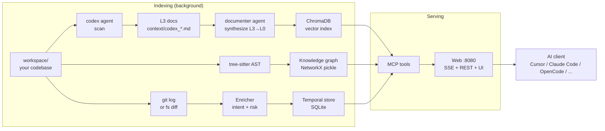
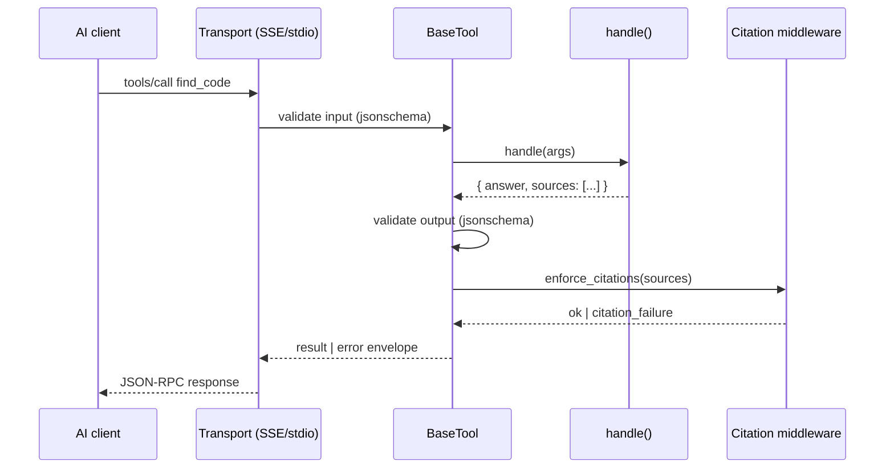

# Architecture

How Heliograph turns a codebase into knowledge that AI agents can query.

---

## 1. The big picture



Three indexing pipelines run independently and produce three artifacts
that the MCP tools query in concert.

---

## 2. Three storage layers

| Layer | What | Where on disk | Built by |
|---|---|---|---|
| **Vector** | Embedded chunks of source + synthesized docs | `./.vectordb/` (Chroma) | `src.main --ingest` |
| **Graph** | AST symbols + call edges + dependency edges | `./.graphdb/` (NetworkX pickle) | `build_graph.py` |
| **Temporal** | Enriched commits with intent + summary + risk | `./context/temporal/store.sqlite` | `src.temporal.run_changelog` |

Each layer is **independent**. Heliograph still works if you only build
one. Tools degrade gracefully (`get_callers` returns "graph empty" when
graph is missing).

---

## 3. The documentation pyramid

Run `--ingest` and Heliograph builds a hierarchy of summaries, indexed
in the vector store :

| Level | What | One per |
|---|---|---|
| **L3** | Raw doc per source file (signature + intent + notes) | source file |
| **L2** | Block-level summary (e.g. one per top-level dir) | block |
| **L1** | Section / service-level summary | service |
| **L0** | Architecture overview (one file, the whole codebase) | codebase |

A user question fans out across all levels ; the reranker picks the
best chunks. High-level questions ("how does auth work?") hit L0/L1 ;
low-level ones ("what does retry.py do at line 142?") hit L3.

---

## 4. The MCP tool lifecycle



Each tool inherits from `BaseTool` and declares :

- `name` + `description` (visible to the LLM)
- `input_schema` + `output_schema` (JSON Schema)
- `requires_citations: bool` — when true, the middleware blocks the
  response unless every cited `path:line_start-line_end` is real.

This is the **grounding contract** : Heliograph refuses to return a
response that points to a file that doesn't exist or a line range that
doesn't fit. Hallucinated paths never reach the client.

---

## 5. Containers

```
┌─────────────────────────────────────────────────────────┐
│  heliograph-web        (FastAPI + MCP SSE on :8080)     │
│  heliograph-indexer    (re-runs scan loop periodically) │
│  heliograph-openwebui  (optional, profile "ui")         │
└─────────────────────────────────────────────────────────┘
```

All three share volumes : `./.vectordb`, `./.graphdb`, `./context`,
`./workspace`. The web container reads from those volumes ; the indexer
writes to them. Single-writer rule for Chroma — only one indexer.

---

## 6. The 3 agents

| Agent | Where it runs | What it produces |
|---|---|---|
| **codex** | CLI / indexer | One L3 doc per source file |
| **documenter** | CLI / indexer | L2 / L1 / L0 synthesis |
| **expert** | Web (MCP `ask_expert` + `/v1/chat/completions`) | Q&A grounded in the indexed docs |

Definitions live in `agents/defs/*.md` ; model + temperature overrides
in `config.yaml → agents:`.

---

## 7. LLM client layer

A single `ResilientClient` in `src/client.py` wraps the OpenAI-compatible
SDK :

- Per-call retry on 502/503/429 (`RETRY_*` in `.env`).
- Per-agent model override.
- Per-agent `extra_params` (e.g. `reasoning_effort: high` for codex).

Anything that speaks `/v1/chat/completions` + `/v1/embeddings` works as
the backend.

---

## 8. Web surface

`heliograph-web` (FastAPI) exposes :

| Path | What |
|---|---|
| `/mcp/sse` | MCP SSE endpoint for AI clients |
| `/mcp/messages` | MCP POST endpoint |
| `/v1/chat/completions` | OpenAI-compatible chat (used by Open WebUI) |
| `/v1/models` | OpenAI-compatible model list |
| `/api/ide/*` | REST wrappers around the MCP tools (IDE-friendly) |
| `/api/stats` | Health + index size |
| `/debug/chat` | Minimal HTML chat for quick checks |
| `/healthz` | Liveness probe |

---

## 9. Where to look in the code

| Concern | Module |
|---|---|
| MCP server lifecycle | `src/mcp/server.py` |
| Tool auto-discovery | `src/mcp/registry.py` |
| Tool base + citation enforcement | `src/mcp/base.py`, `src/mcp/middleware/` |
| Concrete tools | `src/mcp/tools/*.py` |
| Vector store | `src/rag/store.py` |
| Grounding check | `src/rag/grounding.py`, `src/rag/citation_validator.py` |
| Tree-sitter graph | `src/graph/{extractor,resolver,topology,store}.py` |
| Temporal store | `src/temporal/store.py`, `src/temporal/enricher.py` |
| OpenAI-compat web layer | `web/server.py` |
| IDE REST wrappers | `web/ide_routes.py` |
