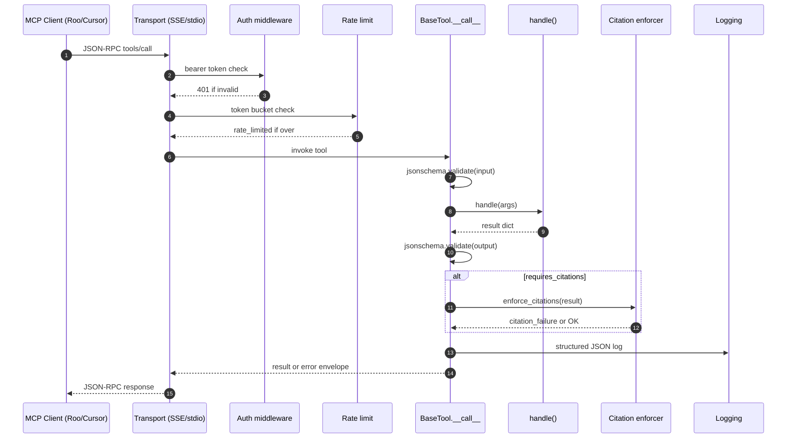
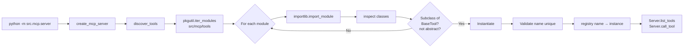
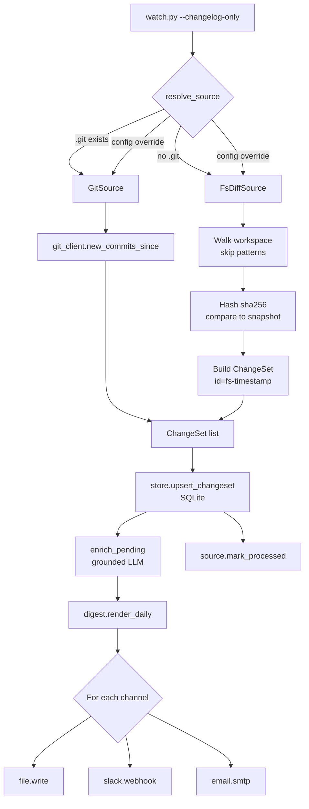
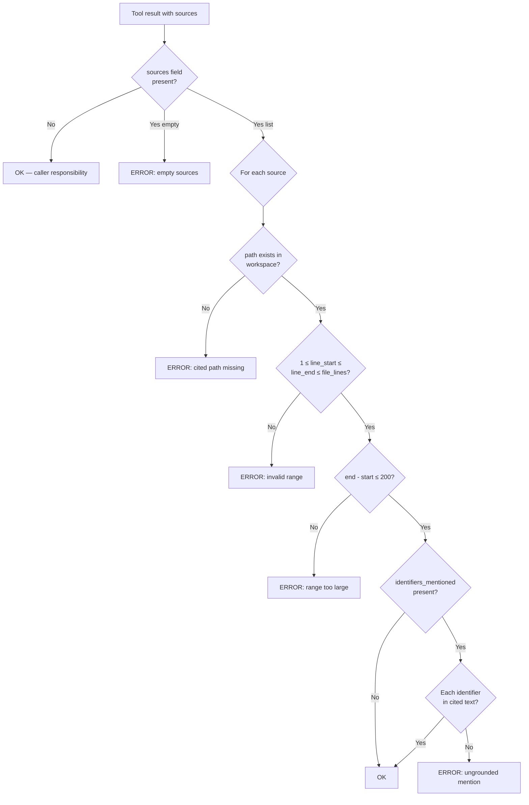
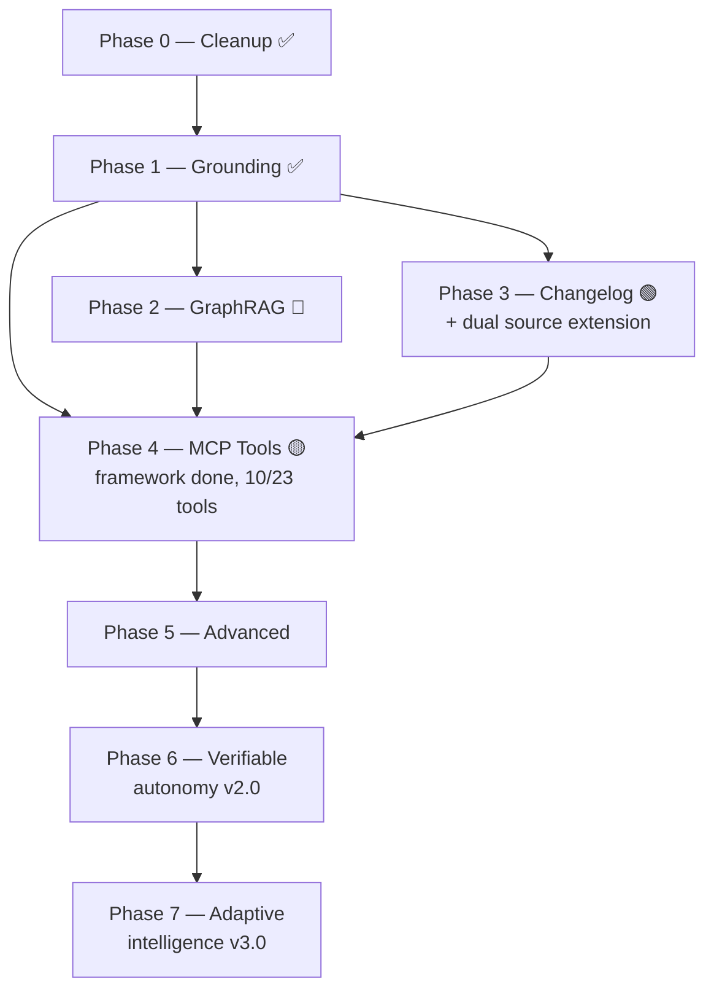
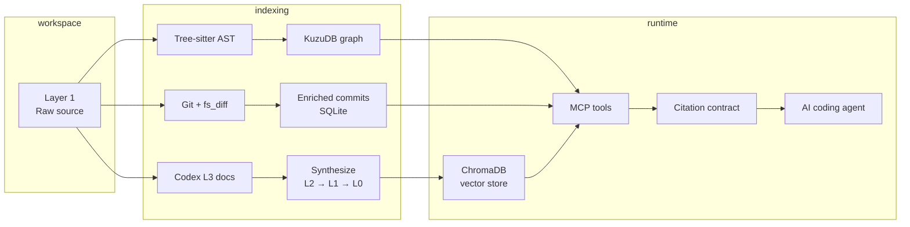

# Architecture diagrams

> Mermaid sources for key Agent Hub flows. Render in any Markdown viewer with Mermaid support.

---

## 1. MCP tool call lifecycle

---

## 2. Tool registry auto-discovery

---

## 3. Changelog dual-source pipeline

---

## 4. Citation enforcement

---

## 5. Phase dependency graph

---

## 6. Layered knowledge model

